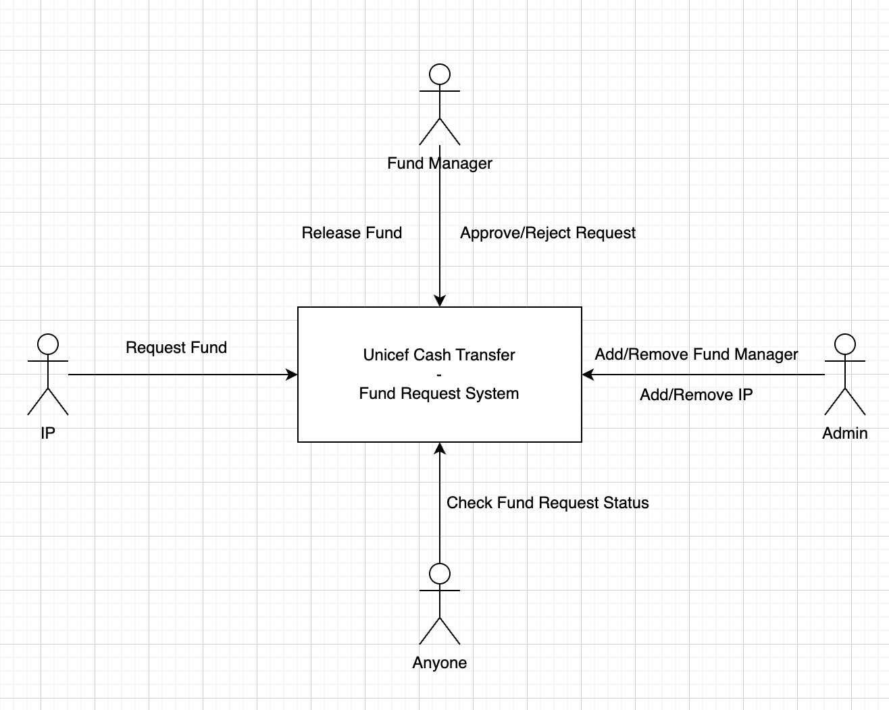

# UnicefCashTransferFundRequestSystem

This project is part of the Unicef Cash Transfer System, it is the backend (based on blockchain) handles the fund requests from Implementing Partners (IP).  
- Whitelisted IPs can create fund requests.  
- Fund managers from Unicef can approve/reject the request and release the fund (not used here because we use physical 
cash) if the request is approved.

The project contains the main contract, a test for that contract, and a script that deploys that contract.

## Main Contract
[UnicefCashTransferFundRequestSystem](./contracts/UnicefCashTransferFundRequestSystem.sol)

## Slides
[unicef.pdf](./unicef.pdf)

## System Architecture



## Run Test
```shell
npx hardhat test
```
or
```shell
REPORT_GAS=true npx hardhat test
```

## Deploy Contract
```shell
npx hardhat run scripts/deploy.ts --network <Network>
```

## Dummy UI
[UI](https://unicef-cash-transfer.github.io/unicef-cash-transfer/#/)
